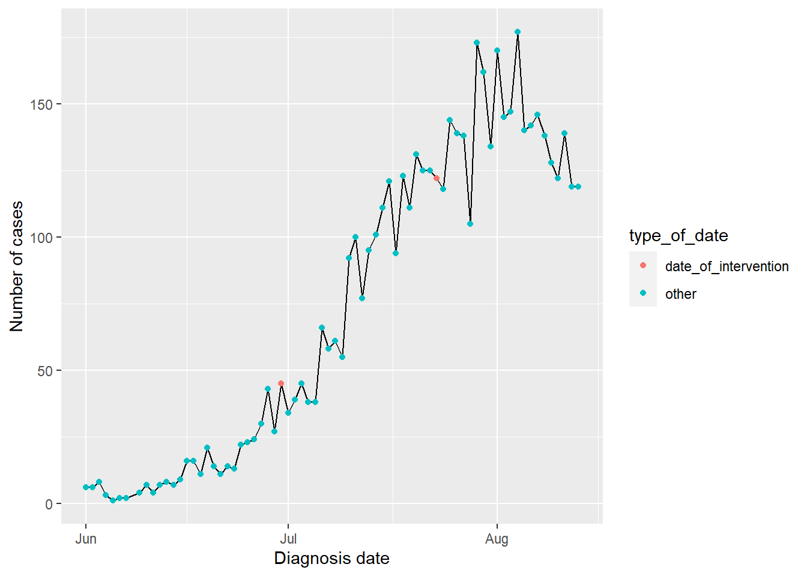
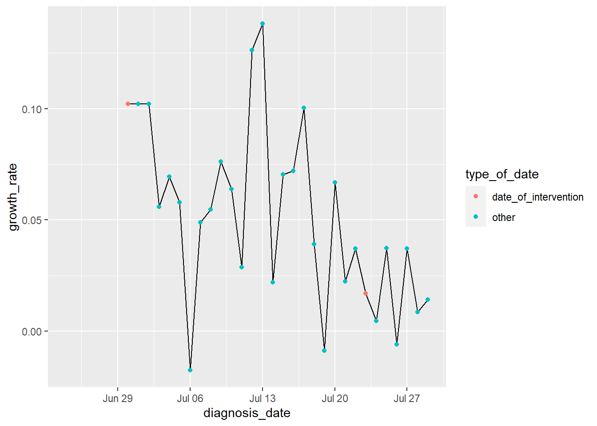

# Data sources


```r
#load case data from the csv
#use eval false as this file will not be included in submission

covid_case_data <- read_csv(here::here("data/NCOV_cases_by_postcode_LGA.csv"))
```


```r
#filter the data for the investigation period
#use eval false as this will not run without original data

data <- covid_case_data %>% filter(diagnosis_date >= "2020-06-01",
                             diagnosis_date <= "2020-08-13") 
```

**1. Where the Data was found**

The data was sourced from the Victoria Health Coronavirus website, which stores the data of all the coronavirus cases throughout Victoria since 2020. They have data sets available for outsiders to download and analyze, as well as post updated information frequently.

Of the data sets available for download the data chosen for this analysis was Victorian case data that contains [*"All data of PCR and RAT cases by Local Government Area and postcode"*](https://www.coronavirus.vic.gov.au/victorian-coronavirus-covid-19-data). This is primarily because this data set contains more variables thereby giving more flexibility and control for the analysis and results. It will help bolster the objective of this analysis and help improve understanding of the results provided.

This data is protected by copyright under a Creative Commons Attribution Version 4.0, which is an international license. Therefore, when using this data we must be mindful of the restrictions laid out in the aforementioned license.

**2. Observational or Experimental Data**

This is a observational data as the Victoria Health department specified that they gathered their data through contact tracing and management of the COVID-19 outbreak. This is indicative that researcher or health professionals do not control the factors affecting the variables, meaning that the variables themselves are independent, but rather they attempt to determine correlation of factors. In this scenario the independent variables are the coronavirus cases or people affected by the coronavirus.

**3. Codebook** 

The codebook for the release data can be found in the data folder. 

**4. Unit and potential Unique Identifier**

The unit of this data is considered to be the number of covid cases. In this data set the "postcode" can be considered a unique identifier as it can easily identify an individual especially when combined with the diagnosis date and case count.

**5. Storing and Analysing the Data**

The data set in its current form can be stored and used for analysis of the research question, however the only variables essential to this analysis is the date of diagnosis and the number of cases on those days. Therefore, to keep the report concise and accurate we will remove all columns except "diagnosis_date" as well as create a new column "total_cases" to give the total number of cases on a given day within the period of interest.


```r
cleaned_data <- data %>% 
  group_by(diagnosis_date)%>%
  summarise(total_cases=n())

#store it in a csv file
#use eval false so the file does not get overwritten when knitting
write.csv(cleaned_data,
          here::here("data","release-data-Ranatunga-Ashvin.csv"),
          row.names=FALSE)
```


```r
#read the data back into the variable of choice

cleaned_data<- read_csv(here::here("data/release-data-Ranatunga-Ashvin.csv"))
```


# 🔍 Analysis

**6. Daily Cases over Time of Interest**


```r
intervention_dates<- c("2020-06-30", "2020-07-23") #store intervention dates in a variable

#do the following to highlight the intervention dates in plot
cleaned_data$type_of_date<- 
  ifelse(cleaned_data$diagnosis_date == intervention_dates,
         "date_of_intervention","other") 

mycolour<- c("date_of_intervention" = "red", "other" = "grey")

#plot on a graph  
cleaned_data %>%
  ggplot(aes(x= diagnosis_date, y= total_cases))+
  geom_line()+
  
  #add code to highlight specific dates
  geom_point(aes(colour = type_of_date))+
  
  labs(x= "Diagnosis date", y = "Number of cases")
```

<div class="figure" style="text-align: center">

<p class="caption">(\#fig:timeseries)Time series of Covid cases from 30th June to the 13th of September 2020</p>
</div>


From this figure we see that the overall trend for the number of cases diagnosed with covid-19 is increasing from the 1st of June to the 13th of September. The 2 point highlighted in red represent the intervention dates in question, the "30th of June 2020" and the "23rd of July" respectively.


**7. The 7-Day Growth Rate**


```r
lockdown_period <- interval(ymd("20200624"), ymd("20200729"))

growth_rate <- cleaned_data %>%
 filter(diagnosis_date %within% lockdown_period) %>% #limit it to the lock down period

  mutate(
 growth_rate=slider::slide_dbl(
 .x = total_cases,
 .f = function(v) {
 log(v[7]/v[1]) / 7 #Seven-day growth rate
 },
 .before=8, #consider only the previous values
 .after = 0
 )
 )
```


```r
#do the same as in previous figure to highlight the intervention dates

growth_rate$type_of_date <- 
  ifelse(growth_rate$diagnosis_date == intervention_dates,
         "date_of_intervention","other") 

mycolour<- c("date_of_intervention" = "red", "other" = "grey")

ggplot(growth_rate,aes(diagnosis_date, growth_rate))+
  geom_line()+
  geom_point(aes(colour = type_of_date))
```

<div class="figure" style="text-align: center">

<p class="caption">(\#fig:growth)Growth Rate of Covid cases within the lockdown period of 30th June to 29th July 2020</p>
</div>


Since we are concerned with effects of local lockdowns, the above growth rate considers the lockdown duration within the investigation period. According to @guardian, the lockdown at that point in time was imposed from the 30th of June to the 29th of July 2020. The growth rate is calculated on a weekly basis, meaning that it is calculated using the number of cases 7 days prior to each given date. The two dates of intervention are highlighted in red.   

The first thing to note from \@ref(fig:growth) is that the growth rate on the 30th of June displays the growth rate of covid cases for the week prior to the lockdown being imposed. This point can considered a reference point to understand the effectiveness of the lockdown. 

We can understand that despite there being an initial spike in the growth rate of cases, it subsided towards the end of the lockdown. It can be seen that the growth rate on the second date of intervention, "23rd July", was lower compared to the previously calculated growth rate. Although not the lowest, the growth rate on the 23rd of July was one of the lowest calculated upto that point and is considerably lower than other dates throughout the lockdown period. This means the lockdown was relatively effective in this period.

**8. Relationship between Growth Rate and Effective Transmission Rate**

a. 

First let us identify what these two terms mean:

The growth rate, in the context of the corona virus in this case, refers to rate at which the number of covid positive cases increase or decrease. While the effective transmission number refers to the average number of people that can be infected by a single person or the number of new infections an individual can cause.

Growth Rate = g

Effective Transmission Number = R(0)

Average duration of infectiousness = T

It follows this equation:

g = R(0) - 1/ T

The reason the equation above subtracts one is to take out the individual or person infecting others out of the equation. The average duration of infectiousness(T), refers to amount of time a person can transmit or pass covid upon contracting it. 

Now lets understand the relationship between growth rate and R(0):

R(0)>1 refers to an individual that is passing on covid to another, meaning that the growth rate will be positive as "anything greater than 1 - 1 = positive value" and time can never be negative. As such, growth rate will increase no matter the magnitude.

On the other hand, the converse is also true. When R(0)<1, it means that an individual is less likely to pass on covid to another meaning that growth rate will be negative. This is because again "anything between 0 and 1 - 1 = negative value", and time(T) can never be negative. Therefore, growth rate will decrease regardless of magnitude and will eventually end at 0.


b.

In class the formula presented was:

Effective transmission number = e^rt, where r= growth rate and t=interval of time

This is a more realistic model for a number of reasons,

- It is difficult to determine the average time of infectiousness as it would vary widely depending on the individual, and therefore is too large of an assumption.

- Additionally, the model in 8a does not give the growth rate over time rather growth rate over infectious period which is of little use.

- The exponential model presented in class gives a more accurate and reliable prediction of the potential progress of the virus. Where if one individual infects 2 others those 2 individuals will infect two more and so forth which is more realistic as people tend to travel a lot.


**9. Estimating R(0) and Change in R(0) due to intervention**

a.

Let us consider the SEIR model for coronavirus specifically. The abbreviation SEIR stands for:

S - People that are Susceptible 

E - People that are Exposed but not infectious

I - People that are Infected and infectious

R - People that have Recovered

This model is used to calculate the number of people affected by covid in a given region or area. It helps determine and understand how contagious the virus is or can be overtime as well as the recovery rate and infectious periods, which then assist officials in making informed decisions to combat the virus, in this context covid-19.

It is understood that *S+E+I+R=1*. This means that the summation of the number of people in these 4 categories make up the entire population of the specific region the SEIR model is being carried out in. It is make clear that all members of the population are considered or accounted for in the computation of this model. Additionally, it ensures that no individual is duplicated. For example, once a person recovers from the coronovirus, they are no longer accounted for in the *I-Infected and infectious* category or any of the other categories.

b.

Since we are interested in the R(0) of the intervention dates, the SEIR model will be calculated using the growth rate on those 2 particular dates. That is the growth rate on the 30th of June and on the 23rd of July 2020. From then on we can compute the effective transimission number and other required values.

c.


```r
times <- seq(int_start(lockdown_period), 
                   int_end(lockdown_period), by = "1 day")
parameters <- c(
 "beta" = 2 / 3,
 "sigma" = 1 / 5,
 "gamma" = 1 / 6 # Gives an R0 (beta/gamma) of 4
) 
population_vic <- 6.681e6 #population in Victoria as at September 2020

initial_infected <- 10
initial_state <- c("S" = population_vic - initial_infected, 
                   "E" = 0, 
                   "I" = initial_infected, 
                   "R" = 0, 
                   "incidence" =0)
```

According to an article in @healthdirect, a person from about 48 hours before symptoms or around 72 hours before symptoms in high risk situations. Additionally, people can be infectious up to 10 days while already having covid. Therefore, finding the average between the two extremes which is 3 days prior and 10 days, I assumed gamma to be 6 as a rounded figure. 


```r
covid_cases_intervention_dates <- function(t, state, parameters) {
 with(as.list(c(state, parameters)), { 
   
 population_vic <- S + E + I + R 
 dSdt <- -beta * S * I / population_vic
 dEdt <- beta * S * I / population_vic - sigma * E
 dIdt <- sigma * E - gamma * I
 dRdt <- gamma * I
 dIncidencedt <- sigma * E
 return(list(
 c(dSdt, dEdt, dIdt, dRdt, dIncidencedt) 
 ))
 })
}
```


d.


```r
initial_assumption <- ode(
  
 y = initial_state,
 times = as.numeric(difftime(times, times[1], units = "days")),
 func = covid_cases_intervention_dates,
 parms = parameters

 )

#display the output
initial_assumption
```

```
##    time       S           E           I           R    incidence
## 1     0 6680990    0.000000   10.000000    0.000000    0.0000000
## 2     1 6680984    5.674347    9.029132    1.567830    0.5969622
## 3     2 6680978   10.085881    9.118474    3.068128    2.1866024
## 4     3 6680971   13.994646    9.950118    4.648272    4.5983903
## 5     4 6680964   17.884922   11.366409    6.417140    7.7835485
## 6     5 6680956   22.090769   13.307442    8.466116   11.7735572
## 7     6 6680946   26.870349   15.775988   10.882181   16.6581689
## 8     7 6680935   32.450999   18.818502   13.756603   22.5751051
## 9     8 6680921   39.057900   22.515622   17.191326   29.7069479
## 10    9 6680905   46.933726   26.978494   21.304297   38.2827907
## 11   10 6680885   56.353770   32.348779   26.234510   48.5832890
## 12   11 6680861   67.639153   38.801251   32.147278   60.9485292
## 13   12 6680833   81.169868   46.548377   39.240108   75.7884847
## 14   13 6680799   97.398772   55.846682   47.749490   93.5961715
## 15   14 6680758  116.867431   67.004869   57.958890  114.9637594
## 16   15 6680709  140.224580   80.393860   70.208254  140.6021147
## 17   16 6680650  168.247968   96.458991   84.905367  171.3643580
## 18   17 6680580  201.870387  115.734767  102.539453  208.2742198
## 19   18 6680495  242.210647  138.862516  123.697408  252.5599240
## 20   19 6680394  290.610960  166.611786  149.083417  305.6952034
## 21   20 6680272  348.681551  199.905905  179.542377  369.4482812
## 22   21 6680126  418.353993  239.852557  216.087919  445.9404760
## 23   22 6679950  501.945418  287.780661  259.936179  537.7168407
## 24   23 6679740  602.235379  345.284482  312.546232  647.8307140
## 25   24 6679487  722.557963  414.276531  375.668574  779.9451046
## 26   25 6679185  866.912190  497.051032  451.403300  938.4543319
## 27   26 6678821 1040.094320  596.359963  542.269869 1128.6298327
## 28   27 6678385 1247.856316  715.504212  651.290764 1356.7949765
## 29   28 6677862 1497.095577  858.442821  782.091802 1630.5346231
## 30   29 6677235 1796.082097 1029.923830  939.022404 1958.9462343
## 31   30 6676482 2154.730195 1235.640988 1127.299769 2352.9407573
## 32   31 6675579 2584.923415 1482.421377 1353.181648 2825.6030249
## 33   32 6674496 3100.902797 1778.449877 1624.173387 3392.6232635
## 34   33 6673197 3719.730355 2133.537647 1949.275935 4072.8135819
## 35   34 6671639 4461.841839 2559.443002 2339.282833 4888.7258354
## 36   35 6669771 5351.705237 3070.254560 2807.135732 5867.3902919
```


```r
#neaten the data output

tidy_function <- function(ode_output, start_date) {
 as_tibble(ode_output) |>
 mutate(
 
 date = as.Date(start_date + days(time)), #include date in the final output
 daily_incidence = c(0, diff(incidence))
 
 )
}

initial_assumption_tidy_output <- 
  tidy_function(initial_assumption, int_start(lockdown_period))

#displaying the output of the data after tidying
initial_assumption_tidy_output
```

```
## # A tibble: 36 × 8
##    time      S         E        I     R     incidence date       daily_incidence
##    <deSolve> <deSolve> <deSolv> <deS> <deS> <deSolve> <date>               <dbl>
##  1 0         6680990    0.0000… 10.0…  0.0…  0.00000… 2020-06-24           0    
##  2 1         6680984    5.6743…  9.0…  1.5…  0.59696… 2020-06-25           0.597
##  3 2         6680978   10.0858…  9.1…  3.0…  2.18660… 2020-06-26           1.59 
##  4 3         6680971   13.9946…  9.9…  4.6…  4.59839… 2020-06-27           2.41 
##  5 4         6680964   17.8849… 11.3…  6.4…  7.78354… 2020-06-28           3.19 
##  6 5         6680956   22.0907… 13.3…  8.4… 11.77355… 2020-06-29           3.99 
##  7 6         6680946   26.8703… 15.7… 10.8… 16.65816… 2020-06-30           4.88 
##  8 7         6680935   32.4509… 18.8… 13.7… 22.57510… 2020-07-01           5.92 
##  9 8         6680921   39.0579… 22.5… 17.1… 29.70694… 2020-07-02           7.13 
## 10 9         6680905   46.9337… 26.9… 21.3… 38.28279… 2020-07-03           8.58 
## # ℹ 26 more rows
```

```r
#displaying the output of the 2 dates of intervention after tidying
initial_assumption_tidy_output[c(7,30),]
```

```
## # A tibble: 2 × 8
##   time      S         E         I     R     incidence date       daily_incidence
##   <deSolve> <deSolve> <deSolve> <deS> <deS> <deSolve> <date>               <dbl>
## 1  6        6680946     26.870…   15…  10.…   16.658… 2020-06-30            4.88
## 2 29        6677235   1796.082… 1029… 939.… 1958.946… 2020-07-23          328.
```


# 📉 Data curation

The criteria I am following in this section is the one laid out by @sheet.

1. The first thing is to be consistent with the organization of your data.
In this Covid-19 data set the variables consistently used were "diagnosed_date" and "total_cases".

2. It is important to choose good and meaningful names for variable and file names. In this data set "diagnosed_data" represents the date a patient was diagnosed to be positive with Covid-19, while "total_cases" represents the total number of cases diagnosed on each date.

3. When writing dates it is best to do so in the universal format YYYY-MM-DD, which has been followed in this analysis as seen in the "diagnosis_date" variable.

4. In terms of putting a single item in a cell, it has been followed in this analysis where each variable has its own respective cell containing information only pertaining to that specific variable. Putting a single item in a cell is generally meant to avoid errors when having to separate items in a cell, which is not seen in this codebook.

5. None of the cells have been left empty. If an something did not relate to a certain variable, the cell was filled with 'NA'. For example, "diagnosis_date" does not in itself have a unit and therefore this cell was filled with NA in the codebook.

6. Calculations have not been included in the data file, rather the data has been kept in its raw ".csv" format. Another way to identify that this concept was followed is from the object "covid_case_data". This object has been transformed and stored in other objects but the original "covid_case_data" object has not been altered but left in its raw state.

7. A data dictionary has been created. It contains the variable names of the filtered data that was used for the analysis. It can be found as a separate file "Codebook".

8. This analysis was backed up onto git hub to protect this folder should anything happen. Attached is the link to the git hub repository [backup](https://github.com/AshvinR12/5512_A4.git).

9. The data has been saved in a plain ".csv" format so as to be easily readable by any machine or program. This makes easier to read the data into R for this analysis.

10. The data was highlighted nor was the font color changed. It has been kept in its raw format for this analysis.

11. One validation method was to ensure that there are no negative values for number of cases. This is due to the fact that number of cases considers people and therefore cannot be negative.

# Resources
